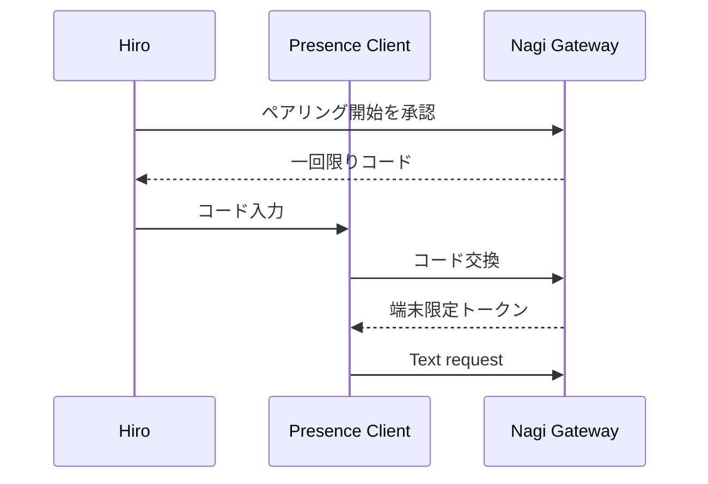

# ADR-001: Conversation Gatewayの配置と認証

- Date: 2026-09-04
- Status: Proposed
- Scope: Nagi Presence Client / independent text route

## Context

現在のPresence UIはGitHub Pagesで配信され、Mem0接続用にはCloudflare Workerの構成が存在する。独立Text Providerを追加するには、プロバイダー秘密鍵をブラウザへ渡さず、単一ユーザー向けPoCの不正利用と予算超過を抑えるGatewayが必要になる。

ただし、GitHub PagesとCloudflare Workerは別Originになる。CORSの許可だけでは認証にならず、Originヘッダーも単独では不正利用防止の根拠として不十分である。

## Decision drivers

1. プロバイダー秘密鍵をクライアントへ置かない
2. 紛失・漏えい時に個別失効できる
3. 月額・セッション利用量をサーバー側で止められる
4. iPhone / iPad中心の利用で、毎回複雑なログインを要求しない
5. 現行GitHub Pagesを直ちに移転しなくてもPoCを進められる
6. 将来、音声経路にも同じ認証境界を使える

## Options

| 案 | 概要 | 利点 | 主な弱点 | 判定 |
|---|---|---|---|---|
| A | Cloudflare Worker + 端末ペアリング用短期トークン | 現行GitHub Pagesを維持可能。トークン単位で失効可能 | 初回ペアリング機構が必要。ブラウザ内に限定資格情報を保持する | PoC推奨 |
| B | UIもCloudflare側へ移し、同一Origin認証 | 認証・Cookie・Gatewayを一体化しやすい | 配信基盤移行が発生。現在の検証範囲を拡大する | 将来候補 |
| C | 各プロバイダーの短期トークンをブラウザへ発行 | Native audioと相性がよい場合がある | トークン発行Gateway自体は必要。プロバイダー差をCoreへ漏らしやすい | 音声評価後 |
| D | CORS + Origin制限だけで公開 | 実装が軽い | 外部クライアントからの利用を十分防げない | 却下 |
| E | 通常のプロバイダーAPIキーをブラウザへ保存 | 実装が最小 | 漏えい・濫用・課金事故の影響が大きい | 禁止 |

## Proposed decision

PoCでは案Aを第一候補とする。

### Approved PoC token-storage subdecision

2026-09-04の明示承認により、初期クライアントはGateway専用トークンを
`sessionStorage`へ保存し、有効期間を最大8時間に制限する。自動更新は行わず、
期限切れまたはタブ終了後は再認証を必要とする。永続的な端末鍵は将来の
WebCrypto方式として別途設計する。

### Aの認証境界

1. プロバイダーAPIキーはWorkerのSecretとしてのみ保持する。
2. Presence ClientはプロバイダーAPIキーを受け取らない。
3. Clientが保持できるのは、凪Gateway専用・端末単位・失効可能なアクセストークンだけとする。
4. トークンはGitHub、配信JavaScript、JSONL、Transcriptへ書かない。
5. Workerはトークンを平文保存せず、照合用ダイジェストと端末ID、発行時刻、失効状態を保持する。
6. トークン失効後は、同じ端末でも再ペアリングを要求する。

ここでいう端末トークンはプロバイダーAPIキーではない。ただし認証情報ではあるため、ブラウザ保存の危険が消えるわけではない。影響範囲をGatewayだけに限定し、短期化・個別失効・予算上限で被害を制限する設計である。

## Pairing flow（未実装）

### ペアリングの安全条件

- コードは一回限りかつ短時間で失効する。
- コード交換回数を制限する。
- 発行操作は自動化せず、対象端末を確認する。
- トークンは端末ごとに識別・失効できる。
- トークンだけで管理APIやSecret操作を許可しない。
- 初期実装では一ユーザー・少数端末に限定する。

## Server-side cost guard

次をWorker側で強制する。

- 1リクエストの最大文字数
- 1分あたりの最大Turn数
- 同時実行Turn数
- セッション単位のSoft / Hard limit
- 月単位のSoft / Hard limit
- Hard limit後の上流API呼び出し禁止
- Provider / Model allow-list

上限値は実測前に推測で固定しない。未設定時は本番Provider呼び出しを許可しない `fail closed` を採用する。

有料利用そのものは禁止しない。Provider、モデル、用途、期間、Soft / Hard limit、再試行条件を一つの利用枠として明示承認し、その範囲内ではTurnごとの確認を求めない。再確認するのは、上限接近、上限変更、Provider / Model変更、想定外の再試行、または新しい課金経路を有効化する場合である。

## Logging decision

Gatewayの標準インフラログへ保存するもの：

- request ID
- hashed device ID
- provider / model ID
- status / latency
- usage units
- estimated cost status
- error code

標準では保存しないもの：

- Provider API key
- 端末トークン
- 全文Context Pack
- 発話・返答本文
- 音声データ

会話本文はConversation Core側の既存Transcript / Event Log方針に従い、Gateway運用ログと混在させない。

## Rejected assumptions

### CORSがあれば本人だけ使える

誤り。CORSはブラウザの読み取り制約であり、公開Endpointに対する非ブラウザ要求の本人確認にはならない。

### GitHub Pagesが非公開鍵を安全に保持できる

誤り。配信JavaScriptやビルド成果物へ埋めた値は秘密として扱えない。

### 使用者が一人なら認証は不要

反証：URLやEndpointが発見・共有・ログ流出した場合、利用者数の想定に関係なく上流課金が発生し得る。

## Open decisions

1. 将来の永続端末鍵：WebCrypto / IndexedDB（PoCの短期トークンはsessionStorageで決定済み）
2. トークン寿命と更新条件
3. ペアリング管理画面の配置
4. Worker側のトークン台帳：KV / D1 / Durable Object等
5. UIをCloudflare側へ移す時期
6. Text Providerとモデル
7. 実測に基づく予算上限

## Implementation gate

次を承認するまで、Worker作成・Secret登録・APIキー発行・DNS変更・配信先変更を行わない。

- PoCで案Aを採用するか
- ペアリング方式
- Token保存場所と寿命
- Gatewayの利用上限
- Text Provider

承認後も、まずローカルのGateway Stubと認証テストを作成し、その後にAPIまたは接続済みコネクタで外部反映する。ブラウザ操作が必要な場合は、操作内容と影響を提示して事前確認する。
